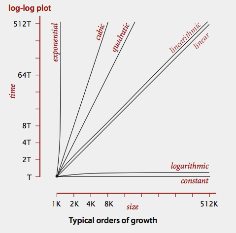

# Analysis of Algorithms
  * [Order of Growth Examples](#order-of-growth-examples)
  * [Memory Examples](#memory-examples)



## [Order of Growth Examples](#analysis-of-algorithms)

What is the order of growth of the worst case running time of the following code fragment
as a function of N?

```
int sum = 0;
for (int i = 1; i*i <= N; i = i*4)
    sum++;
```
[Answer 1](#oog1)

```
int sum = 0;
for (int i = 1; i*i <= N; i = i*2)
    for (int j = 0; j < i; j++)
        sum++;
```
[Answer 2](#oog2)

```
int sum = 0;
for (int i = 0; i < N*N; i++)
    for (int j = i; j < N; j++)
        sum++;
```
[Answer 3](#oog3)

## [Memory Examples](#analysis-of-algorithms)
Given the following definition of a MysteryBox object.
Using the 64-bit memory cost model from lecture, how many bytes does
each object of type MysteryBox use? Include all memory allocated when the
client calls new MysteryBox().

```
public class MysteryBox {
    private final int x0;
    private final boolean y0, y1, y2;
    private final long z0, z1, z2, z3;
    private final double[] a = new double[248];
    ...
}
```
[Answer 1](#mem1)

```
public class MysteryBox {
    private final long x0, x1;
    private final double y0, y1, y2, y3;
    private final int z0, z1;
    private final boolean[] a = new boolean[280];
    ...
}
```
[Answer 2](#mem2)

```
public class MysteryBox {
    private final int x0, x1, x2;
    private final boolean y0;
    private final double z0, z1, z2, z3;
    private final long[] a = new long[152];
    ...
}
```
[Answer 3](#mem3)

```
public class MysteryBox {
        private Node first;

        private static class Node {
            private long item;
            private Node next;
            private Node prev;
        }
        ...
    }
```
[Week 2, Answer 1](#wk2_mem1)

Consider an object of type GenericMysteryBox<Long> that stores N items of type Long
in a generic array items[] of length N.    
**Hint:** an object of the wrapper type Long uses 24 bytes.
```
    public class GenericMysteryBox<Item> {
        private int N;
        private Item[] items;
        ...
    }
```
[Week 2, Answer 2](#wk2_mem2)

```
    public class MysteryBox {
        private Node first;

        private static class Node {
            private int item;
            private Node next;
        }
        ...
    }
[Week 2, Answer 3](#wk2_mem3)


## [Order of Growth Example Answers](#order-of-growth-examples)

### oog1
log N => The i loops iterates ~ log_4 (N^1/2) ~ lg N times.

### oog2
N^(1/2) => The body of inner loop is executed 1 + 2 + 4 + 8 + ... + sqrt(N) ~ 2 sqrt(N) times.

### oog3
N^2 => The i loop iterates N^2 times; the body of the j loop executes only when i < N.

## [Memory Example Answers](#memory-examples)

### mem1
```
public class MysteryBox {                           //   16 (object overhead)
    private final int x0;                           //    4 (1 int)
    private final boolean y0, y1, y2;               //    3 (3 boolean)
    private final long z0, z1, z2, z3;              //   32 (4 long)
    private final double[] a = new double[248];     //    8 (reference to array)
                                                    // 2008 (double array of size 248)
    ...                                                   1 (padding to round up to a multiple of 8)
}                                                      ----
                                                       2072
```

### mem2
```
public class MysteryBox {                           //   16 (object overhead)
    private final long x0, x1;                      //   16 (2 long)
    private final double y0, y1, y2, y3;            //   32 (4 double)
    private final int z0, z1;                       //    8 (2 int)
    private final boolean[] a = new boolean[280];   //    8 (reference to array)
                                                    //  304 (boolean array of size 280)
    ...                                                   0 (padding to round up to a multiple of 8)
}                                                      ----
                                                        384
```

### mem3
```
public class MysteryBox {                           //   16 (object overhead)
    private final int x0, x1, x2;                   //   12 (3 int)
    private final boolean y0;                       //    1 (1 boolean)
    private final double z0, z1, z2, z3;            //   32 (4 double)
    private final long[] a = new long[152];         //    8 (reference to array)
                                                    // 1240 (long array of size 152)
    ...                                                   3 (padding to round up to a multiple of 8)
}                                                      ----
                                                       1312
```

### wk2_mem1
```
public class MysteryBox {                     //       16 (object overhead)
    private Node first;                       //        8 (reference)

    private static class Node {               //       16 (object overhead)
        private long item;                    //        8 (long)
        private Node next;                    //        8 (reference)
        private Node prev;                    //        8 (reference)
                                                        0 (padding to round up to a multiple of 8)
    }                                             -------
                                                 24 + 40N  ~ 40N
```

### wk2_mem2
```
public class GenericMysteryBox<Item> {        //       16 (object overhead)
    private int N;                            //        4 (int)
    private Item[] items;                     //        8 (reference to array)
                                              //  8N + 24 (array of Long references)
                                              //      24N (Long objects)
    ...                                                 4 (padding to round up to a multiple of 8)
}                                                 -------
                                                 32N + 56  ~ 32N
```
Long is a wrapper type for long. Its size is:    
16(overhead) + 8(long value) + 0(padding)


### wk2_mem3
```
    public class MysteryBox {                 //       16 (object overhead)
        private Node first;                   //        8 (reference)

        private static class Node {           //       16 (object overhead)
            private int item;                 //        4 (1 int)
            private Node next;                //        8 (reference)
        }                                     //        4 (padding)
                                                  -------
                                                 24 + 32N ~ 32N
```

