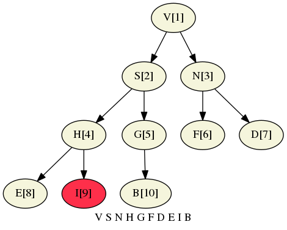

# Priority Queues
Remove the **largest** (or **smallest**) item.

## Code
  * **API and elementary implementations**    
    * Client, [TopM.py](../py/AlgsSedgewickWayne/TopM.py), prints the top M elements.     
      It uses a priority queue, [MinPQ.py](../py/AlgsSedgewickWayne/MinPQ.py), of 
      [Transaction.py](../py/AlgsSedgewickWayne/Transaction.py) elements, which contain a
      [Date.py](../py/AlgsSedgewickWayne/Date.py) data member
    * [UnorderedArrayMaxPQ.py](../py/AlgsSedgewickWayne/UnorderedArrayMaxPQ.py) is a 
      simple unordered array implementation of priority queue.   
  * The **binary heap** data structure is used to implement ordered array priority queues:    
    * [MaxPQ.py](../py/AlgsSedgewickWayne/MaxPQ.py)    
    * [MinPQ.py](../py/AlgsSedgewickWayne/MinPQ.py)    
  * **heapsort** is an efficient sorting algorithm: [Heap.py](../py/AlgsSedgewickWayne/Heap.py)   
  * **event-driven simulation** of N particles subject to the laws of elastic collision:     
    [CollisionSystem.py](../py/AlgsSedgewickWayne/CollisionSystem.py) of 
    [Particle.py](../py/AlgsSedgewickWayne/Particle.py)

## Table of Contents for Examples
  1. API example from lecture: [**$ TopM.py 5 < tinyBatch.txt**](#ex1)
  2. Visualize binary heap violation: [child value exceeds parent value](#ex2)

## Examples
### [ex1](#table-of-contents-for-examples)
1. API example from lecture, *APIs and Elementary Implementations (12:52)*, at 05:40
```
$ TopM.py 5 < ../../thirdparty/tinyBatch.txt
```
```
Thompson   2/27/2000   4747.08
vonNeumann 2/12/1994   4732.35
vonNeumann 1/11/1999   4409.74
Hoare      8/18/1992   4381.21
vonNeumann 3/26/2002   4121.85
```

### [ex2](#table-of-contents-for-examples)
2. Visualize binary heap violation: child value exceeds parent value.    
Child, I, is greater than parent, H:
```
python -c 'import AlgsSedgewickWayne.testcode.binary_heaps as E; E.wr_png("V S N H G F D E I B")'
```

