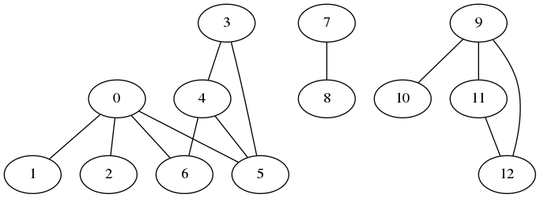

# [Undirected Graphs](http://algs4.cs.princeton.edu/41graph/)

## Code
  * [Graph.py](../py/AlgsSedgewickWayne/Graph.py)    
  * [DepthFirstPaths.py](../py/AlgsSedgewickWayne/DepthFirstPaths.py)    
  * [BreadthFirstPaths.py](../py/AlgsSedgewickWayne/BreadthFirstPaths.py)    

## Table of Contents for Examples
  1. [Run Graph Example](#ex1) on [tinyG.txt](../thirdparty/tinyG.txt)
  2. [Run BreadthFirstPaths](#ex2) on [tinyG.txt](../thirdparty/tinyG.txt)

## Examples 
### [ex1](#table-of-contents-for-examples)
Run Graph Example on [tinyG.txt](../thirdparty/tinyG.txt)
```
test_Graph.py ../thirdparty/tinyG.txt
```
    
```
13 vertices, 13 edges
0: 6 2 1 5
1: 0
2: 0
3: 5 4
4: 5 6 3
5: 3 4 0
6: 0 4
7: 8
8: 7
9: 11 10 12
10: 9
11: 9 12
12: 11 9
```

### [ex2](#table-of-contents-for-examples)
Run BreadthFirstPaths on [tinyG.txt](../thirdparty/tinyG.txt)
```
test_BreadthFirstPaths.py ../thirdparty/tinyCG.txt 0
```
```
6 vertices, 8 edges
0: 1 2 5
1: 0 2
2: 0 1 3 4
3: 2 4 5
4: 2 3
5: 0 3
0 to 0 (0):  0
0 to 1 (1):  0-1
0 to 2 (1):  0-2
0 to 3 (2):  0-2-3
0 to 4 (2):  0-2-4
0 to 5 (1):  0-5
```

Copyright (C) 2002-2015 Robert Sedgewick and Kevin Wayne.  All rights reserved.    
Copyright (C) 2014-2015 DV Klopfenstein. All rights reserved. Python translation.
