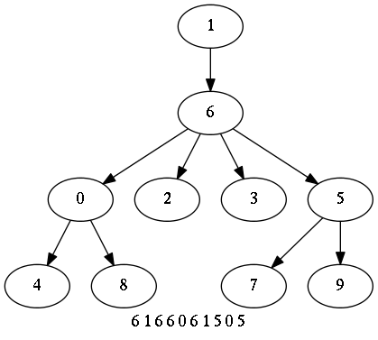
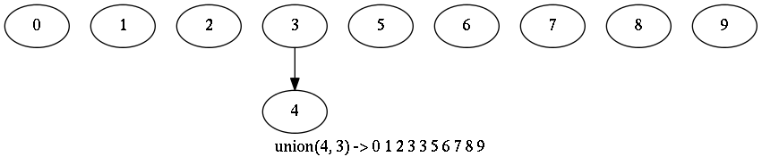
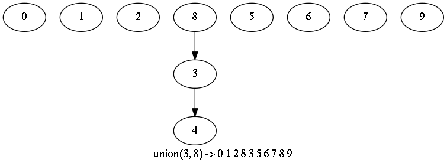
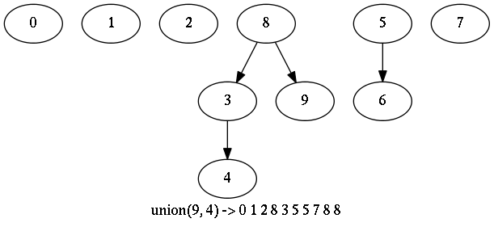
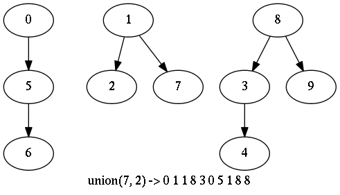
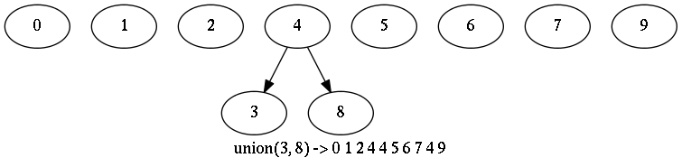
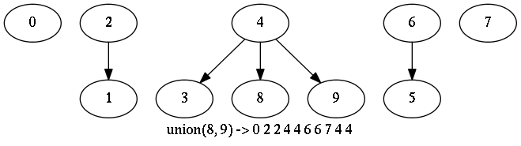
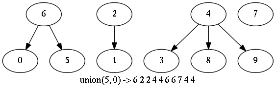

# QuickUnion

## Code
  * [QuickFindUF.py](../py/AlgsSedgewickWayne/QuickFindUF.py)
  * [QuickUnionUF.py](../py/AlgsSedgewickWayne/QuickUnionUF.py)
  * [WeightedQuickUnionUF.py](../py/AlgsSedgewickWayne/WeightedQuickUnionUF.py) puts smaller tree under bigger tree (improvement #1)
  * [WeightedQuickUnionPlusUF.py](../py/AlgsSedgewickWayne/WeightedQuickUnionPlusUF.py) with path compression (improvement #2)

## Table of Contents for Examples
  1. [Force the state of QuickUnion and visualize](#ex1)
  2. [Recreate demo from **Quick Union (7:50)** lecture](#ex2)
  3. [Recreate demo from **Quick-Union Improvements (13:02)** lecture](#ex3)

## Examples
Run examples from \<PrincetonAlgorithms repository\>/tests    
Must be in PYTHONPATH: \<base_dir\>/PrincetonAlgorithms/py
### [ex1](#table-of-contents-for-examples)
1. Force the state of QuickUnion and visualize: From the cmdline...   
```
> python -c 'import AlgsSedgewickWayne.QuickUnionUF as Q; Q.QuickUnionUF(10).wr_png_tree_statestr("6 1 6 6 0 6 1 5 0 5")'
```    
This state would actually not be possible to create using **unions** because
the size of the tree rooted at parent of 6 < twice the size of the tree
rooted at 6    



### [ex2](#table-of-contents-for-examples)
2. Recreate demo from **Quick Union (7:50)** lecture: From the cmdline...

Run these unions using QuickUnion with no speed improvements (Weighting, Path compression):
```
  union(7-3) 
  union(6-1) 
  union(7-2) 
  union(5-0) 
  union(8-9) 
  union(2-1) 
  union(9-4) 
  union(6-5) 
  union(3-8) 
  union(4-3) 

> python -c 'import test_QuickUnionUF as T; T.test_week1_lecture()'

IDX:  0  1  2  3  4  5  6  7  8  9    
val:  0  1  2  3  4  5  6  7  8  9 Initial values    
IDX:  0  1  2  3  4  5  6  7  8  9    
val:  0  1  2  3  3  5  6  7  8  9 union(4-3) [0] [1] [2] [3, 4] [5] [6] [7] [8] [9]    
```    
    
```
IDX:  0  1  2  3  4  5  6  7  8  9    
val:  0  1  2  8  3  5  6  7  8  9 union(3-8) [0] [1] [2] [5] [6] [7] [8, 3, 4] [9]    
```    
    
```
IDX:  0  1  2  3  4  5  6  7  8  9    
val:  0  1  2  8  3  5  5  7  8  9 union(6-5) [0] [1] [2] [5, 6] [7] [8, 3, 4] [9]    
```    
    
```
IDX:  0  1  2  3  4  5  6  7  8  9    
val:  0  1  2  8  3  5  5  7  8  8 union(9-4) [0] [1] [2] [5, 6] [7] [8, 9, 3, 4]    
```    
    
```
IDX:  0  1  2  3  4  5  6  7  8  9    
val:  0  1  1  8  3  5  5  7  8  8 union(2-1) [0] [1, 2] [5, 6] [8, 9, 3, 4] [7]    
```    
    
```
IDX:  0  1  2  3  4  5  6  7  8  9    
val:  0  1  1  8  3  5  5  7  8  8 union(8-9) [0] [1, 2] [5, 6] [8, 9, 3, 4] [7]    
```    
    
```
IDX:  0  1  2  3  4  5  6  7  8  9    
val:  0  1  1  8  3  0  5  7  8  8 union(5-0) [0, 5, 6] [1, 2] [8, 9, 3, 4] [7]    
```    
    
```
IDX:  0  1  2  3  4  5  6  7  8  9    
val:  0  1  1  8  3  0  5  1  8  8 union(7-2) [0, 5, 6] [1, 2, 7] [8, 9, 3, 4]    
```    
    
```
IDX:  0  1  2  3  4  5  6  7  8  9    
val:  1  1  1  8  3  0  5  1  8  8 union(6-1) [8, 9, 3, 4] [0, 1, 2, 5, 6, 7]    
```    
    
```
IDX:  0  1  2  3  4  5  6  7  8  9    
val:  1  8  1  8  3  0  5  1  8  8 union(7-3) [0, 1, 2, 3, 4, 5, 6, 7, 8, 9]    
```    
    


### [ex3](#table-of-contents-for-examples)
3. Recreate demo from **Quick-Union Improvements (13:02)** lecture
```
> python -c 'import test_WeightedQuickUnionUF as T; T.test_week1_lecture()'

IDX:  0  1  2  3  4  5  6  7  8  9
val:  0  1  2  3  4  5  6  7  8  9
siz:  1  1  1  1  1  1  1  1  1  1 Initial values
IDX:  0  1  2  3  4  5  6  7  8  9
val:  0  1  2  4  4  5  6  7  8  9
siz:  1  1  1  1  2  1  1  1  1  1 union(4-3) [9] [0] [7] [8] [6] [2] [5] [1] [3, 4]
```
    
```
IDX:  0  1  2  3  4  5  6  7  8  9
val:  0  1  2  4  4  5  6  7  4  9
siz:  1  1  1  1  3  1  1  1  1  1 union(3-8) [9] [0] [7] [6] [2] [5] [1] [8, 3, 4]
```
    
```
IDX:  0  1  2  3  4  5  6  7  8  9
val:  0  1  2  4  4  6  6  7  4  9
siz:  1  1  1  1  3  1  2  1  1  1 union(6-5) [9] [0] [7] [5, 6] [2] [1] [8, 3, 4]
```
    
```
IDX:  0  1  2  3  4  5  6  7  8  9
val:  0  1  2  4  4  6  6  7  4  4
siz:  1  1  1  1  4  1  2  1  1  1 union(9-4) [0] [7] [5, 6] [2] [1] [8, 9, 3, 4]
```
    
```
IDX:  0  1  2  3  4  5  6  7  8  9
val:  0  2  2  4  4  6  6  7  4  4
siz:  1  1  2  1  4  1  2  1  1  1 union(2-1) [1, 2] [0] [7] [5, 6] [8, 9, 3, 4]
```
    
```
IDX:  0  1  2  3  4  5  6  7  8  9
val:  0  2  2  4  4  6  6  7  4  4
siz:  1  1  2  1  4  1  2  1  1  1 union(8-9) [1, 2] [0] [7] [5, 6] [8, 9, 3, 4]
```
    
```
IDX:  0  1  2  3  4  5  6  7  8  9
val:  6  2  2  4  4  6  6  7  4  4
siz:  1  1  2  1  4  1  3  1  1  1 union(5-0) [1, 2] [7] [0, 5, 6] [8, 9, 3, 4]
```
    
```
IDX:  0  1  2  3  4  5  6  7  8  9
val:  6  2  2  4  4  6  6  2  4  4
siz:  1  1  3  1  4  1  3  1  1  1 union(7-2) [1, 2, 7] [0, 5, 6] [8, 9, 3, 4]
```
    
```
IDX:  0  1  2  3  4  5  6  7  8  9
val:  6  2  6  4  4  6  6  2  4  4
siz:  1  1  3  1  4  1  6  1  1  1 union(6-1) [1, 7] [0, 2, 5, 6] [8, 9, 3, 4]
```
    
```
IDX:  0  1  2  3  4  5  6  7  8  9
val:  6  2  6  4  6  6  6  2  4  4
siz:  1  1  3  1  4  1 10  1  1  1 union(7-3) [8, 1, 3, 9, 7] [0, 2, 4, 5, 6]
```
    

