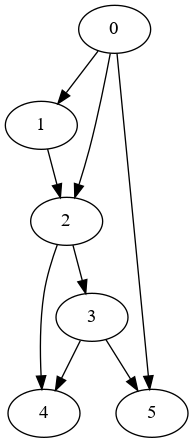
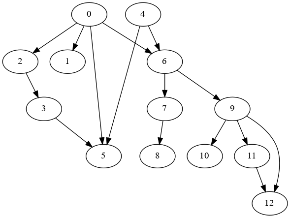

# Plots
* [Graphs](#graphs)
  * [tinyG.txt](#tinygtxt)
* [Digraphs](#digraphs)
  * [tinyDG.txt](#tinydgtxt)
  * [tinyDG2.txt](#tinydg2txt)
  * [tinyDAG.txt](#tinydag2txt)

## Graphs
### tinyG.txt
```
13 vertices, 13 edges
0: 1 2 5 6
1: 0
2: 0
3: 4 5
4: 3 5 6
5: 0 3 4
6: 0 4
7: 8
8: 7
9: 10 11 12
10: 9
11: 9 12
12: 9 11
```


## Digraphs
### tinyDG.txt
```
13 vertices, 22 edges
0: 1 5
1:
2: 0 3
3: 2 5
4: 2 3
5: 4
6: 0 8 4 9
7: 9 6
8: 6
9: 10 11
10: 12
11: 12 4
12: 9
```


### tinyDG2.txt
```
6 vertices, 8 edges
0: 1 2
1: 2
2: 4
3: 2 5
4: 3
5: 0
```



### [tinyDAG.txt](https://algs4.cs.princeton.edu/42digraph/tinyDAG.txt)
```
13 vertices, 15 edges
13
15
2 3 
0 6 
0 1 
2 0 
11 12  
9 12  
9 10  
9 11 
3 5 
8 7 
5 4 
0 5 
6 4 
6 9 
7 6
```



Copyright (C) 2020-present, DV Klopfenstein. All rights reserved.
