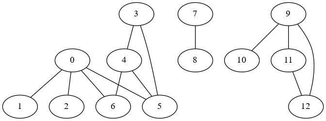
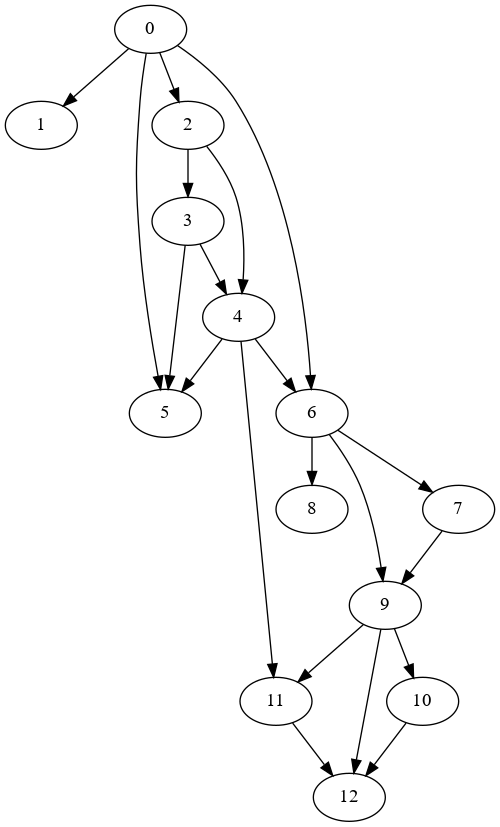

# Plots
* [Graphs](#graphs)
* [Digraphs](#digraphs)

## Graphs
### tinyG.txt
```
13 vertices, 13 edges
0: 1 2 5 6
1: 0
2: 0
3: 4 5
4: 3 5 6
5: 0 3 4
6: 0 4
7: 8
8: 7
9: 10 11 12
10: 9
11: 9 12
12: 9 11
```


## Digraphs
```
### tinyDG.txt
13 vertices, 22 edges
0: 1 5
1:
2: 0 3
3: 2 5
4: 2 3
5: 4
6: 0 8 4 9
7: 9 6
8: 6
9: 10 11
10: 12
11: 12 4
12: 9
```

